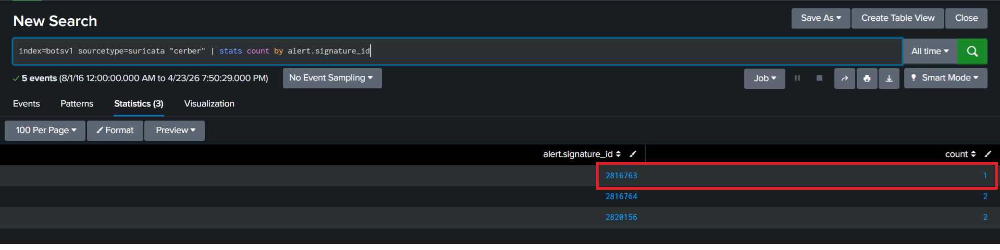
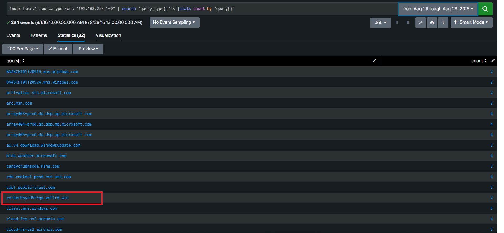
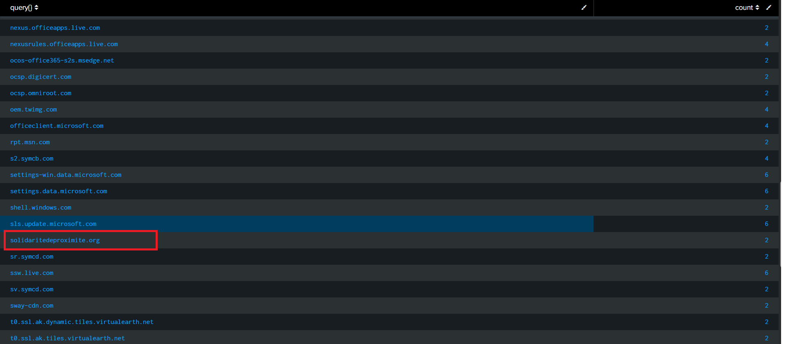
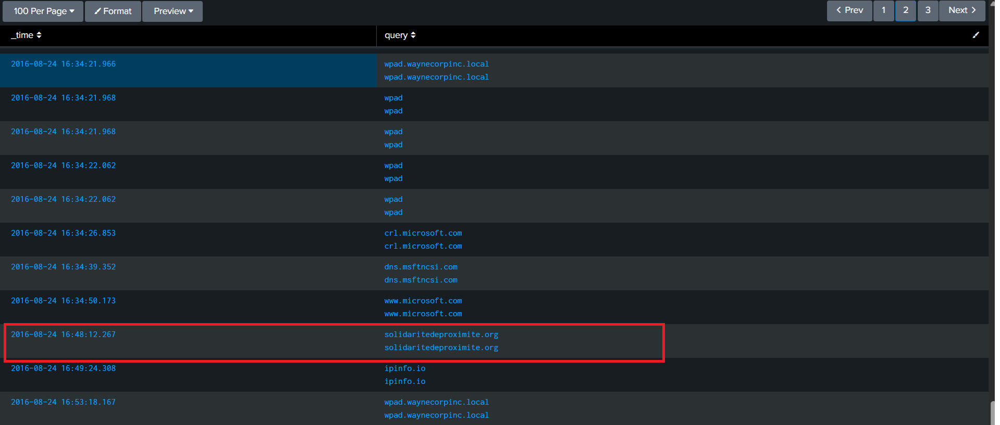
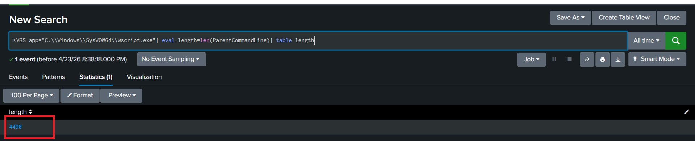
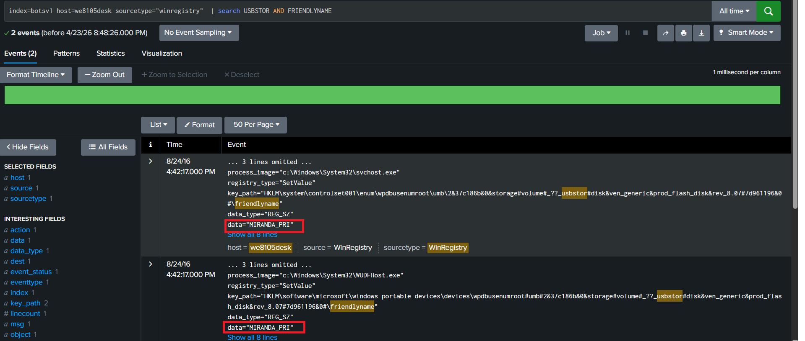

# Ransomeware Investogation Report

## Scenario:-
After the excitement of yesterday, Alice has started to settle into her new job. Sadly, she realizes her new colleagues may not be the crack cybersecurity team that she was led to believe before she joined. Looking through her incident ticketing queue she notices a “critical” ticket that was never addressed. Shaking her head, she begins to investigate. Apparently on August 24th Bob Smith (using a Windows 10 workstation named we8105desk) came back to his desk after working-out and found his speakers blaring (click below to listen), his desktop image changed (see below) and his files inaccessible.

Alice has seen this before... ransomware. After a quick conversation with Bob, Alice determines that Bob found a USB drive in the parking lot earlier in the day, plugged it into his desktop, and opened up a word document on the USB drive called "Miranda_Tate_unveiled.dotm". With a resigned sigh she begins to dig into the problem...

## Summary:-
Alice had just started her job. While reviewing the ticketing queue, she discovered a critical ticket that had not been addressed. On 24 August 2016, a computer named **we8105desk** (used by Bob Smith) was infected with **ransomware**. The issue began when Bob Smith found a USB device in the parking lot and plugged it into his computer. He then opened a file named **“Miranda_Tate_unveiled.dotm”** from the USB

After opening the file, the system showed clear signs of ransomware:
- Files became inaccessible
- The desktop wallpaper changed
- Unexpected audio started playing 

This indicates that the file contained malicious macros, which executed and installed ransomware on the system.

## Detection Details:-

- **User:** Bob Smith 
- **Date of Incident:** 24 August 2016
- **Host Machine:** we8105desk (Windows 10) 
- **Attack Vector:** USB (Removable Media) 
- **Malicious File:** Miranda_Tate_unveiled.dotm 
- **Infection Type:** Ransomware

**200. What was the most likely IPv4 address of we8105desk on 24AUG2016?**
**Ans:** From the scenario, we already know that the affected machine is **we8105desk.**
This is also confirmed from the file **Alice-Journal.html**, which contains details about the incident.
To find the IP address of this machine, I searched the Splunk logs using the hostname.
I used the following query:
```spl
index=botsv1 host=we8105desk | stats count by src_ip | sort - count
```

## Analysis:-
- After running the query, 192.168.250.100 appeared 53,106 times, which is the highest among all IP addresses, while the other IPs appeared only a few times.
- The IP address with the highest count is considered the main IP of the machine because a system usually communicates using its assigned IP address for most of its activity. 
- The other IP addresses generally represent broadcast traffic, localhost, temporary or rare connections, or background network noise.
- Therefore, 192.168.250.100 is the most likely IPv4 address of we8105desk, as it has the highest number of occurrences in the logs, indicating that most of the system’s network activity originated from this IP.

**Answer: 192.168.250.100**

**201. Amongst the Suricata signatures that detected the Cerber malware, which one alerted the fewest number of times? Submit ONLY the signature ID value as the answer?**
**Ans:** Since the question mentions Cerber ransomware, I searched the Suricata IDS logs in Splunk for any events related to Cerber.
```spl
index=botsv1 sourcetype=suricata "cerber"
```


- This search returned **5 events** related to Cerber
- Each event contains a field called **alert.signature_id**, which shows which detection rule was triggered.
- Since the question asks to find **which alert occurred the least number of times**, so I used another query to count how many times each signature ID appears.
```spl
index=botsv1 sourcetype=suricata "cerber" | stats count by alert.signature_id
```
- This query groups the events by signature id.
- It counts how many times each one appears and sorts them from lowest to highest.


**Answer: 2816763**

**202. What fully qualified domain name (FQDN) does the Cerber ransomware attempt to direct the user to at the end of its encryption phase?**
**Ans:** 
## Analysis:-
- To identify the domain (FQDN) used by the Cerber ransomware, I analyze DNS logs in Splunk.
- DNS (Domain Name System) is responsible for converting domain names into IP addresses.
- Since malware needs to connect to a domain before communicating with its server, DNS logs are very useful for detecting such activity.
```spl
index=botsv1 sourcetype=*dns "192.168.250.100" | search "query_type{}"=A |stats count by "query{}"
```
- I searched within botsv1 dataset.
- Then focused on DNS logs using sourcetype=*DNS (* Stands for all).
- Then used the infected IPV4 machine IP 192.168.250.100.
- Then filtered A records (query_type{}=A) to get the domain lookup.
- Finally searched with query using count by.



## Findings:-
- Total **234 DNS** events found.
- Found 2 suspicious domain one is **solidaritedeproximite.org** and another **cerberhhyed5frqa.xmfir0.win**
- This domain **cerberhhyed5frqa.xmfir0.win**
- It looks like it’s not human readable one looked very fishy as compared to another one. Unusual one.

**Answer: cerberhhyed5frqa.xmfir0.win**

**203. What was the first suspicious domain visited by we8105desk on 24AUG2016?**
**Ans:**
## Analysis
- To find the first domain accessed by the user, I slightly modified my previous query.
- Instead of counting domains, I added time **(_time)** and removed the count so I could see the events in order.
```spl
index=botsv1 sourcetype=*dns "192.168.250.100" "query_type{}"=A |sort _time | table _time query
```


## Findings:-
•	Sorted all DNS queries by time (earliest first)
•	Looked at the sequence of domains accessed
•	Earlier, I had two suspicious domains **(.org and .win)**
•	By checking the events in time order, I found which domain was accessed first by the system **we8105desk on 24 AUG 2016**
•	The first domain which was accessed was solidaritedeproximite.org

**Answer: solidaritedeproximite.org**

**204. During the initial Cerber infection a VB script is run. The entire script from this execution, pre-pended by the name of the launching .exe, can be found in a field in Splunk. What is the length of the value of this field?**
**Ans:**
## Analysis:-
- To investigate the initial Cerber infection, I searched for VBScript execution using *VBS.
- From the results, I found a suspicious command C:\Windows\System32\wscript.exe
- wscript.exe is used to run VB scripts.
- It was executed only once, which makes it suspicious.
- It is likely used to run the ransomware script.
- I then added this command to the filter to narrow down the results.
- Next, I focused on the ParentCommandLine field, which contains.
- The full VB script, along with the name of the .exe that launched it.
- To find the answer, I calculated the length of this field using.
```spl
| eval length=len(ParentCommandLine)
```
### Full query
```spl
*VBS app="C:\\Windows\\SysWOW64\\wscript.exe"| eval length=len(ParentCommandLine)| table length
```


**Answer: 4490**

**205. What is the name of the USB key inserted by Bob Smith?**
**Ans:**
## Analysis:-
- I searched the Windows Registry logs because they store detailed information about USB devices.
- I used the keywords **USBSTOR to find USB storage devices and FRIENDLYNAME to get the device name in a readable format** 
- This helped me quickly locate the USB device details.
- From the results, I found the **friendly name** of the USB device **MIRANDA_PRI**
```spl
index=botsv1 host=we8105desk sourcetype="winregistry"  | search USBSTOR AND FRIENDLYNAME
```


**Answer: USB device MIRANDA_PRI**


