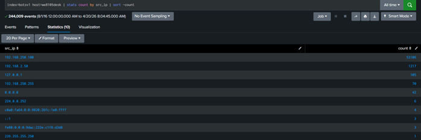

# Ransomeware Investogation Report

## Scenario:-
After the excitement of yesterday, Alice has started to settle into her new job. Sadly, she realizes her new colleagues may not be the crack cybersecurity team that she was led to believe before she joined. Looking through her incident ticketing queue she notices a “critical” ticket that was never addressed. Shaking her head, she begins to investigate. Apparently on August 24th Bob Smith (using a Windows 10 workstation named we8105desk) came back to his desk after working-out and found his speakers blaring (click below to listen), his desktop image changed (see below) and his files inaccessible.

Alice has seen this before... ransomware. After a quick conversation with Bob, Alice determines that Bob found a USB drive in the parking lot earlier in the day, plugged it into his desktop, and opened up a word document on the USB drive called "Miranda_Tate_unveiled.dotm". With a resigned sigh she begins to dig into the problem...

## Summary:-
Alice had just started her job. While reviewing the ticketing queue, she discovered a critical ticket that had not been addressed. On 24 August 2016, a computer named **we8105desk** (used by Bob Smith) was infected with **ransomware**. The issue began when Bob Smith found a USB device in the parking lot and plugged it into his computer. He then opened a file named **“Miranda_Tate_unveiled.dotm”** from the USB

After opening the file, the system showed clear signs of ransomware:
- Files became inaccessible
- The desktop wallpaper changed
- Unexpected audio started playing 

This indicates that the file contained malicious macros, which executed and installed ransomware on the system.

## Detection Details:-

- **User:** Bob Smith 
- **Date of Incident:** 24 August 2016
- **Host Machine:** we8105desk (Windows 10) 
- **Attack Vector:** USB (Removable Media) 
- **Malicious File:** Miranda_Tate_unveiled.dotm 
- **Infection Type:** Ransomware

**200. What was the most likely IPv4 address of we8105desk on 24AUG2016?**
**Ans:** From the scenario, we already know that the affected machine is **we8105desk.**
This is also confirmed from the file **Alice-Journal.html**, which contains details about the incident.
To find the IP address of this machine, I searched the Splunk logs using the hostname.
I used the following query:
```spl
index=botsv1 host=we8105desk | stats count by src_ip | sort - count
```

## Analysis:-
- After running the query, 192.168.250.100 appeared 53,106 times, which is the highest among all IP addresses, while the other IPs appeared only a few times.
- The IP address with the highest count is considered the main IP of the machine because a system usually communicates using its assigned IP address for most of its activity. 
- The other IP addresses generally represent broadcast traffic, localhost, temporary or rare connections, or background network noise.
- Therefore, 192.168.250.100 is the most likely IPv4 address of we8105desk, as it has the highest number of occurrences in the logs, indicating that most of the system’s network activity originated from this IP.

**Answer: 192.168.250.100**

**201. Amongst the Suricata signatures that detected the Cerber malware, which one alerted the fewest number of times? Submit ONLY the signature ID value as the answer?**
**Ans:** Since the question mentions Cerber ransomware, I searched the Suricata IDS logs in Splunk for any events related to Cerber.
```spl
index=botsv1 sourcetype=suricata "cerber"
```


